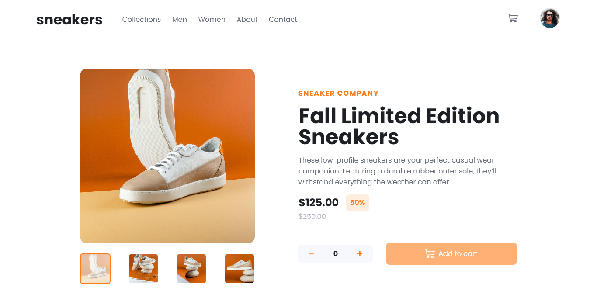

# Frontend Mentor - E-commerce product page solution

This is a solution to the [E-commerce product page challenge on Frontend Mentor](https://www.frontendmentor.io/challenges/ecommerce-product-page-UPsZ9MJp6). Frontend Mentor challenges help you improve your coding skills by building realistic projects.

## Table of contents

- [Overview](#overview)
  - [The challenge](#the-challenge)
  - [Screenshot](#screenshot)
  - [Links](#links)
  - [Built with](#built-with)
  - [What I learned](#what-i-learned)
  - [Continued development](#continued-development)
  - [Useful resources](#useful-resources)
- [Author](#author)
- [Acknowledgments](#acknowledgments)

## Overview

### The challenge

Users should be able to:

- View the optimal layout for the site depending on their device's screen size
- See hover states for all interactive elements on the page
- Open a lightbox gallery by clicking on the large product image
- Switch the large product image by clicking on the small thumbnail images
- Add items to the cart
- View the cart and remove items from it

### Screenshot

### Links

- Solution URL: [Add solution URL here](https://www.frontendmentor.io/solutions/ecommerceproductpagemain-made-with-html-css-and-javascript-0WTMzDsxj)
- Live Site URL: [Add live site URL here](https://ecommerce-product-page-main.netlify.app/)

### Built with

- Semantic HTML5 markup
- Flexbox
- Mobile-first workflow
- Vanilla Javascript

### What I learned

- Javascript pop() method

### Continued development

- I plan to improve my Javascript knowledge and make my code more readable

## Author

- Twitter - [@brightadigwe](https://www.twitter.com/brightadigwe)

## Acknowledgments

i want to aknowledge frontendmentor and kelvin Powell YT
